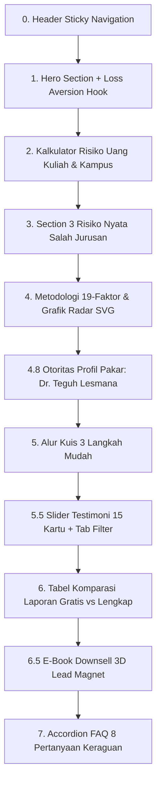

# 🎨 DESIGN.md — Spesifikasi Desain & System Tokens Landing Page Better Future (ISCA)

Dokumen ini berisi arsitektur desain, token visual, palet warna, tipografi, hirarki CRO (*Conversion Rate Optimization*), dan struktur 11 section dari halaman pendaratan [`better_future_landing_page_sample.html`](file:///c:/MARCHEL%20FILES/ANTIGRAVITY/MARKETING%20AGENT/better_future_landing_page_sample.html).

---

## 💎 1. Core Design System & Tokens

### 🎨 Color Palette
```css
:root {
  /* Surface & Backgrounds */
  --bg-page: #0A0F1D;           /* Deepest Space Navy (Page Background) */
  --bg-surface: #0F172A;        /* Dark Slate Surface */
  --bg-card: #1E293B;           /* Elevated Card Layer */
  --bg-card-alt: #12161D;       /* Subdued Dark Card Layer */
  
  /* Text Colors */
  --text-main: #F8FAFC;         /* High Contrast Off-White */
  --text-muted: #94A3B8;        /* Soft Cool Gray */
  --text-dark: #040D1A;         /* Ultra-Dark Navy for Action Buttons */

  /* Accent Colors */
  --accent-lime: #10B981;       /* High Contrast Action Lime Green (WCAG AAA) */
  --accent-gold: #C09846;       /* Premium Authority Gold */
  --accent-gold-light: #F59E0B; /* Bright Warm Gold */
  --urgency-red: #DC2626;       /* Crimson Red Primary Urgency */
  --urgency-red-dark: #991B1B;  /* Dark Crimson Gradient End */
  --neon-pulse: #FEF08A;        /* Neon Yellow Pulse Dot */

  /* Shadows & Borders */
  --shadow-premium: 0 24px 80px rgba(0, 0, 0, 0.45);
  --border-glass: 1px solid rgba(255, 255, 255, 0.1);
  --border-gold-dashed: 1px dashed rgba(192, 152, 70, 0.4);

  /* Border Radii */
  --radius-sm: 8px;
  --radius-md: 12px;
  --radius-lg: 18px;
  --radius-xl: 24px;
}
```

---

## 👁️ 2. Principles of CRO & Psychological Triggers

1. **Fear of Financial Loss (Loss Aversion)**:
   - Menyoroti angka risiko nyata: **Rp100 Juta+ Uang Pangkal Menguap Sia-sia** akibat 87% kasus mahasiswa salah pilih jurusan.
   - Mengubah persepsi harga tes Rp120.000 menjadi **"Polis Asuransi Keputusan Murah"** (0,1% dari total risiko).

2. **Aturan 3 Detik (*3-Second Rule Urgency Pill*)**:
   - Badge kuota menyala warna merah solid (`#DC2626` ➔ `#991B1B`) dengan titik neon kuning yang berkedip (`@keyframes pulse-ring`) di paling atas Hero Section: `⚡ Kuota Tes Gratis Hari Ini: Sisa 78 / 100 • 14.280+ Siswa Terpetakan`.

3. **WCAG AAA Compliance & High-Contrast CTAs**:
   - Tombol eksekusi utama (`.bf-btn--action`) menggunakan warna **Hijau Mint/Lime (`#10B981`)** dengan warna teks **Hitam Pekat (`#040D1A`, font-weight: 900)**. Rasio kontras melebihi 9.5:1.
   - Tombol dilengkapi animasi mikro riak bersinar berkelanjutan (`@keyframes cta-pulse-glow`).

---

## 🏛️ 3. Peta 11 Section Landing Page Sample



### Breakdown Detail Tiap Section:

1. **Header Sticky Navigation (`.header`)**:
   - Logo: `betterfuture` (opsi aksen emas pada kata *future*).
   - Tautan Navigasi: `Kalkulator · Risiko · Metode Tes · Dr. Teguh · Alur Tes · Testimoni · Hasil Laporan · FAQ`.
   - Tombol Aksi Header: `Mulai Tes Gratis` (Lime Green).

2. **Hero Section (`.hero`)**:
   - Background Video: `headache_woman.mp4` overlay transparan.
   - Urgency Badge: `⚡ Kuota Tes Gratis Hari Ini: Sisa 78 / 100 • 14.280+ Siswa Terpetakan`.
   - Headline H1: *"Sebelum Menyerahkan Rp 100 Juta Uang Pangkal, Yakin Pilihan Jurusan Anak Sudah Tepat?"*
   - Sub-headline: *"87% mahasiswa Indonesia merasa salah memilih jurusan kuliah. Petakan potensi 19-Faktor secara ilmiah..."*
   - Tombol CTA: `Mulai Pemetaan Gratis →` dan `Kalkulator Risiko`.

3. **Kalkulator Risiko Uang Kuliah (`#kalkulator`)**:
   - Grid 8 Tombol Kampus Preset (4 PTN: UI, ITB, UGM, IPB vs 4 PTS: UPH, BINUS, UMY, UII).
   - Perhitungan otomatis kerugian dana kuliah (SPP, UKT, Kost, Uang Pangkal) jika anak pindah jurusan.

4. **Section 3 Risiko Nyata (`#masalah`)**:
   - 3 Kartu Dampak: Kerugian Finansial Rp100Jt+, Penyesalan Waktu 4 Tahun, dan Konflik Emosional Keluarga.

5. **Metodologi 19-Faktor Psikologi (`#metode`)**:
   - 5 Instrumen Ilmiah: RIASEC (WHAT), MBTI (HOW), DISC (BEHAVIOR), 16PF (STABILITY), VAK (PROCESS).
   - Mockup Grafik Radar SVG Interaktif dengan Badge Akurasi 98,4% & 0-Bias Multi-Instrumen.

6. **Profil Otoritas Pakar (`#psikolog`)**:
   - Foto Dr. Teguh Lesmana, M.Psi., Psi (`dr_teguh_profile.png`) berbingkai emas ganda dengan floating badge `✓ Verified Psychologist`.
   - Kutipan Personal: *"Setiap anak lahir dengan bakat unik. Tugas kita sebagai orang tua dan pendidik bukan memaksakan kehendak, melainkan membantu mereka menemukan kompas hidupnya sejak awal."*
   - 3 Badge Kredensial: Magister & Doktor Psikologi, Psikolog Terlisensi HIMPSI, 15+ Tahun Bimbingan Ortu & Anak.

7. **Alur Kuis 3 Langkah Mudah (`#alur`)**:
   - Langkah 1: Isi Tes Minat Bakat (20 Menit).
   - Langkah 2: Lengkapi Data Pasca Tes.
   - Langkah 3: Terima Laporan Instan via WhatsApp.

8. **Slider Testimoni 15 Kartu (`#testimoni`)**:
   - 4 Filter Tab Interaktif: `Semua (15)`, `👨‍👩‍👧 Orang Tua (5)`, `🎓 Siswa SMA (7)`, `🏫 Guru & Kepsek (3)`.
   - Fitur Slider Carousel otomatis menyesuaikan jumlah kartu aktif per slide.

9. **Tabel Komparasi Laporan SaaS Side-by-Side (`#laporan`)**:
   - Matrix perbandingan Laporan Dasar Gratis (Rp0) vs Laporan Lengkap 19 Halaman PDF + AI Counselor (Rp120.000 sekali bayar).
   - Dilengkapi horizontal scroll responsif untuk HP.

10. **Downsell E-Book 3D Lead Magnet (`#downsell`)**:
    - Mockup 3D E-Book "Diplomasi Orang Tua-Anak: Menentukan Jurusan Tanpa Perdebatan" + Form kirim ke WhatsApp.

11. **Accordion FAQ 8 Pertanyaan (`#faq`)**:
    - 8 Pertanyaan & Jawaban lengkap yang mematahkan seluruh kecemasan calon pembeli (privasi, keabsahan tes, diplomasi ortu-anak, dll).

---

## 📱 4. Responsivitas & Media Queries

- `@media (max-width: 968px)`:
  - Hero grid berganti menjadi 1 kolom centered.
  - Univ preset grid berganti menjadi 2 kolom.
  - Section Dr. Teguh (`.expert-grid`) otomatis berpusat di tengah dengan margin yang disesuaikan.
  - Tabel komparasi dapat digeser (*touch overflow scroll*).
- `@media (max-width: 480px)`:
  - Navigasi header disembunyikan untuk menjaga kerapian mobile viewport.
  - Ukuran font H1 menyesuaikan ke 32px agar tidak *overflow*.

---

## 📂 5. Lokasi File Proyek
- **File Landing Page HTML**: [`better_future_landing_page_sample.html`](file:///c:/MARCHEL%20FILES/ANTIGRAVITY/MARKETING%20AGENT/better_future_landing_page_sample.html)
- **Dokumen Strategi 3 Angle**: [`landing_page_angles_strategy.md`](file:///C:/Users/WELCOME/.gemini/antigravity/brain/bb5f31e9-09cb-4e56-950c-67da8ec561e0/landing_page_angles_strategy.md)
- **Dokumen Desain System**: [`DESIGN.md`](file:///c:/MARCHEL%20FILES/ANTIGRAVITY/MARKETING%20AGENT/DESIGN.md)
