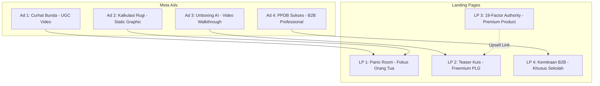

# 🎯 Rencana Strategi ATM (Amati, Tiru, Modifikasi) & Struktur Kampanye
**Better Future (ISCA) vs. Satu Persen**

Dokumen ini berisi analisis mendalam terhadap halaman penjualan premium dan gaya iklan Meta Ads dari Satu Persen, serta cetak biru peluncuran **4 Varian Iklan** dan **4 Varian Landing Page** Better Future untuk mencapai konversi tertinggi di pasar Indonesia.

---

## 🔍 1. ANALISIS KONTRAK LANDING PAGE SATU PERSEN

### **A. Kelebihan (Kekuatan Konversi)**
1.  **Daftar Nilai Manfaat yang Padat (High Perceived Value):** Menyajikan paket "12 Psikotes Premium dalam 1 Pembelian". Terasa sangat murah untuk harga Rp79.000.
2.  **Tombol Pembuktian (Social Proof Button):** Memiliki dua tombol sekunder yang sangat efektif meredakan keraguan pembeli:
    *   *“Lihat contoh hasil tes”* (Menunjukkan PDF 19 halaman).
    *   *“Lihat contoh hasil konsultasi”* (Menunjukkan dokumen tanya jawab dengan psikolog).
3.  **Elemen Urgensi:** Menampilkan kotak diskon 80% terbatas dengan visual *countdown timer*.
4.  **FAQ yang Solutif:** Bagian FAQ menjawab pertanyaan operasional secara detail (kapan hasil dikirim, bagaimana cara konsultasi, dll).

### **B. Kekurangan (Celah untuk Kita Sempurnakan)**
1.  **Hambatan Pembayaran di Depan (No Freemium):** Pengguna wajib membayar Rp79.000 *sebelum* menjawab satu pun pertanyaan. Ini memotong konversi dari trafik dingin (*cold traffic*) yang belum percaya dengan brand.
2.  **Laporan Bersifat Pasif (Static PDF):** Hasil hanya dikirimkan lewat email berupa dokumen PDF statis. Konsultasi lanjutan bersifat *asynchronous* (isi form, tunggu balasan 3 hari kerja). Terasa lambat dan kurang interaktif bagi Gen Z.
3.  **Desain Visual Dingin & Kaku:** Layout bergaya fungsional standar, minim narasi emosional orang tua.
4.  **Hanya B2C:** Tidak menyediakan alur bagi orang tua untuk membelikan lisensi untuk beberapa anak sekaligus, atau opsi kemitraan sekolah (B2B).

---

## ⚙️ 2. MATRIKS STRATEGI KAMPANYE (4 ADS vs. 4 LANDING PAGES)

Untuk mendapatkan biaya per akuisisi (CPA) terendah, kita akan membagi kampanye menjadi **4 jalur relevansi tinggi** (Setiap varian iklan mengarah ke landing page dengan sudut pandang yang sama):

---

## 📺 3. CETAK BIRU 4 VARIAN IKLAN META ADS (ATM SATU PERSEN)

### **Ad Varian 1: "Curhat Bunda" (Format: UGC Video — Target: Ibu/Bunda Usia 35-55)**
*   **ATM dari Satu Persen:** Satu Persen menggunakan curhat mahasiswa (Gen Z) yang menyesal salah jurusan. Kita modifikasi ke **sudut pandang orang tua** yang menanggung beban stres & biaya.
*   **Naskah Hook:** *"Bunda, nyesel banget kalau kita baru tahu anak kita stres salah jurusan pas uang pangkal Rp20 Juta terlanjur disetor ke kampus..."*
*   **Visual:** Video vertikal (9:16) seorang ibu paruh baya sedang duduk santai bercerita jujur di depan kamera HP.

### **Ad Varian 2: "Kalkulasi Penyesalan" (Format: Static Graphic — Target: Orang Tua Rasional)**
*   **ATM dari Satu Persen:** Infografik kuning datar tentang nominal uang kuliah. Kita modifikasi dengan foto emosional **[stressed_parent_college.jpg](file:///c:/MARCHEL FILES/ANTIGRAVITY/MARKETING AGENT/stressed_parent_college.jpg)** yang sangat dramatis.
*   **Copywriting:** 
    *   *Kiri (Merah):* Kuliah Salah Jurusan = Rugi Rp143 Juta + 4 Tahun Terbuang + Anak Depresi.
    *   *Kanan (Hijau):* Tes Better Future = Rp149.000 (Jaminan Masa Depan Anak & AI Counselor 24/7).

### **Ad Varian 3: "Unboxing AI Counselor" (Format: Video Walkthrough — Target: Siswa & Ortu Modern)**
*   **ATM dari Satu Persen:** Menunjukkan scroll PDF statis. Kita modifikasi dengan menunjukkan **keunggulan AI interaktif**.
*   **Visual:** Rekaman layar HP mengetik pertanyaan di dasbor WhatsApp Better Future: *"Hasil tesku IT, tapi aku lemah di matematika. Harus ambil kursus apa ya, Kak?"* Lalu tunjukkan AI membalas dalam 3 detik dengan rekomendasi rinci.

### **Ad Varian 4: "PPDB Booster" (Format: Single Image B2B — Target: Kepala Sekolah/Yayasan)**
*   **ATM dari Satu Persen:** Satu Persen tidak mengiklankan B2B. Kita buat variasi ini untuk kemitraan massal.
*   **Visual:** Foto sekolah bersih dengan logo akreditasi A, headline: *"Ubah Tes Minat Bakat Murid Baru Menjadi Magnet Pendapatan PPDB Sekolah Anda."*

---

## 💻 4. CETAK BIRU 4 VARIAN LANDING PAGE (PENYEMPURNAAN KONTRAK)

### **LP Varian 1: "The Parent Panic Room" (Mengarah dari Ad 1 & Ad 2)**
*   **Headline Utama:** *"Jangan Biarkan Tabungan Pendidikan Rp100 Juta+ Anda Lenyap Akibat Anak Salah Memilih Jurusan Kuliah."*
*   **Penyempurnaan vs Satu Persen:**
    *   Visual berfokus pada kecemasan orang tua (bukan gambar animasi ceria).
    *   Tautan contoh hasil tes difokuskan pada **"Panduan Khusus Orang Tua Membimbing Karir Anak"** (Satu Persen hanya memberikan hasil tes untuk siswa).

### **LP Varian 2: "The Interactive Teaser" (Mengarah dari Ad 3 — Jalur PLG)**
*   **Alur Pengalaman:** Pengguna tidak langsung diminta bayar. Landing page langsung menampilkan kuis mini 3 pertanyaan awal yang interaktif dan menyenangkan.
*   **Penyempurnaan vs Satu Persen:** Menghilangkan biaya di awal. Hasil teaser dikirim via WhatsApp gratis, lalu penawaran produk lengkap Rp149k dilakukan di dalam chat WhatsApp (konversi jauh lebih tinggi karena nomor WA terverifikasi).

### **LP Varian 3: "The 19-Factor Authority Hub" (Landing Page Utama / Kontrol)**
*   **Headline Utama:** *"Pahami Potensi Sejati Anak Melalui Peta Bakat 19-Faktor Terintegrasi."*
*   **Penyempurnaan vs Satu Persen:**
    *   Menampilkan diagram perbandingan: 5 Alat Ukur Better Future (MBTI + RIASEC + DISC + 16PF + Gaya Belajar) vs. Tes Tunggal Kompetitor.
    *   Menyediakan tombol live chat demo dengan maskot *Navi*.

### **LP Varian 4: "B2B Partnership Portal" (Mengarah dari Ad 4)**
*   **Headline Utama:** *"Program Kemitraan Sekolah Modern: Optimalkan Penjurusan Murid Sekaligus Tingkatkan Angka PPDB Sekolah Swasta Anda."*
*   **Formulir Aksi:** Form singkat bagi Kepala Sekolah/Panitia PPDB untuk memesan sesi sosialisasi & kupon tes massal gratis bagi 10 siswa pertama.
